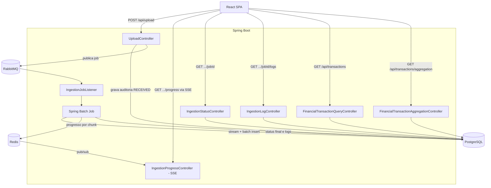
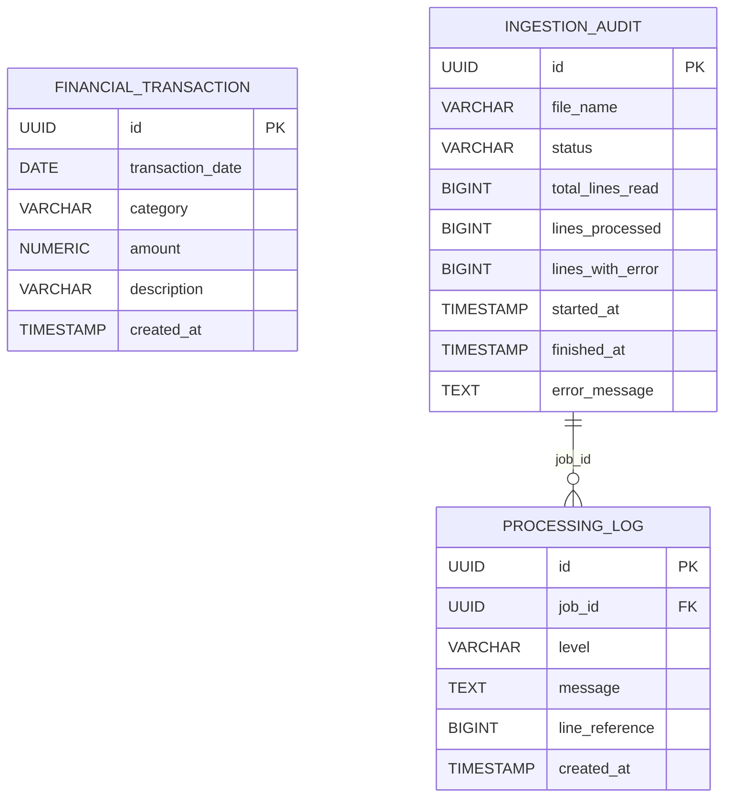

# DataScale — Sistema de Ingestão e Análise de Dados em Larga Escala

Sistema para receber, processar e exibir arquivos de transações financeiras com
milhões de registros, sem travar o navegador do usuário e sem derrubar o
servidor por falta de memória (OOM).

## Sumário

- [O problema](#o-problema)
- [Por que essa solução](#por-que-essa-solução)
- [Status atual do projeto](#status-atual-do-projeto)
- [Arquitetura (system design)](#arquitetura-system-design)
  - [Visão geral](#visão-geral)
  - [Fluxo de ingestão, passo a passo](#fluxo-de-ingestão-passo-a-passo)
  - [Backend](#backend)
  - [Modelagem de dados](#modelagem-de-dados)
  - [Índices e paginação](#índices-e-paginação)
  - [Frontend](#frontend)
- [Decisões arquiteturais](#decisões-arquiteturais)
  - [Como evitamos o estouro de memória](#como-evitamos-o-estouro-de-memória)
  - [Estratégia de inserção rápida no banco](#estratégia-de-inserção-rápida-no-banco)
  - [Como os índices foram pensados](#como-os-índices-foram-pensados)
- [Endpoints da API](#endpoints-da-api)
- [Como rodar o projeto](#como-rodar-o-projeto)
- [Configuração (variáveis de ambiente)](#configuração-variáveis-de-ambiente)
- [Gerando um dataset de teste](#gerando-um-dataset-de-teste)
- [Estrutura de pastas](#estrutura-de-pastas)
- [Diferenciais implementados](#diferenciais-implementados)

---

## O problema

A empresa recebe arquivos CSV pesados — transações financeiras ou telemetria —
com **milhões de linhas**. Dois riscos concretos precisavam ser resolvidos ao
mesmo tempo:

1. **Memória do servidor**: carregar um arquivo de milhões de linhas inteiro em
   RAM antes de processar derruba a aplicação por `OutOfMemoryError`, mesmo em
   ambientes com heap generoso.
2. **Experiência do usuário**: se o upload travar a UI esperando o
   processamento terminar (que pode levar minutos para arquivos grandes), a
   aplicação parece quebrada, mesmo funcionando corretamente por baixo.

O sistema precisa, portanto, separar **recebimento** de **processamento**, dar
feedback em tempo real de que o trabalho está acontecendo, e continuar
respondendo rápido nas consultas mesmo com a tabela principal já contendo
milhões de linhas.

## Por que essa solução

A escolha de arquitetura segue direto dos dois riscos acima:

- **Leitura em stream + processamento em chunks** (Spring Batch) resolve a
  memória: o arquivo nunca é lido inteiro de uma vez, é consumido em lotes
  fixos que são descartados da memória assim que gravados.
- **Fila assíncrona** (RabbitMQ) resolve a experiência do usuário: o upload
  devolve resposta na hora, o processamento pesado acontece em background,
  desacoplado da requisição HTTP.
- **Cache + pub/sub** (Redis) resolve o feedback em tempo real sem sobrecarregar
  o banco: o progresso é publicado fora do Postgres, que já está ocupado
  gravando os dados reais.
- **Índices compostos pensados para o padrão de acesso real** (não só "criar
  índice em tudo") resolvem a performance de leitura, tanto para paginação
  quanto para agregação, mesmo com a tabela crescendo continuamente.

Cada uma dessas decisões está detalhada, com o raciocínio completo, na seção
[Decisões arquiteturais](#decisões-arquiteturais).

## Status atual do projeto

Documentação honesta do que está funcionando hoje versus o que ainda está em
construção:

| Parte | Status |
|---|---|
| Upload assíncrono (CSV → fila → Job) | ✅ Funcionando, testado com 1M e 5M linhas |
| Streaming + batch insert (Spring Batch) | ✅ Funcionando, validado sem crescimento de memória |
| Auditoria da ingestão (`ingestion_audit`) | ✅ Funcionando |
| Log detalhado por linha (`processing_log`) | ✅ Gravado no banco — endpoint REST para consulta (`GET /api/ingestion/{jobId}/logs`) **ainda não implementado** |
| Progresso em tempo real (Redis + SSE) | ✅ Funcionando |
| Endpoint de status pontual | ✅ Funcionando |
| Paginação por keyset | ✅ Funcionando, validado com `EXPLAIN ANALYZE` |
| Agregação por categoria/mês | ✅ Funcionando |
| Frontend — tela de upload com progresso | ✅ Funcionando (React + SSE) |
| Frontend — dashboard de métricas agregadas | ⏳ Pendente |
| Frontend — listagem | ✅ Funcionando |
| `docker-compose.yml` (Postgres/RabbitMQ/Redis) | ✅ Funcionando |

## Arquitetura (system design)

### Visão geral



### Fluxo de ingestão, passo a passo

1. O usuário seleciona um CSV na tela de upload e envia via `multipart/form-data`.
2. O `UploadController` recebe o arquivo, cria um registro de auditoria com
   status `RECEIVED`, move o arquivo para disco em stream (sem materializar o
   conteúdo inteiro no heap) e publica uma mensagem no RabbitMQ com o `jobId` e
   o caminho do arquivo. A resposta HTTP (`202 Accepted`) volta imediatamente.
3. O `IngestionJobListener`, consumindo a fila, dispara o Job do Spring Batch.
4. O Job lê o CSV em stream (`FlatFileItemReader`), valida e converte cada
   linha (`FinancialTransactionItemProcessor`), e grava em lotes de 5.000
   linhas via JDBC puro (`JdbcBatchItemWriter`).
5. Linhas inválidas nunca derrubam o Job — são puladas
   (`AlwaysSkipItemSkipPolicy`) e registradas em `processing_log` com o motivo
   exato da falha.
6. A cada lote processado, o progresso (linhas lidas/gravadas/com erro) é
   publicado no Redis — como uma chave com o último estado e como uma
   mensagem num canal pub/sub.
7. O `IngestionProgressController` expõe um endpoint SSE que assina esse canal
   e empurra as atualizações para o frontend em tempo real, sem polling.
8. Ao final, o `IngestionJobExecutionListener` grava o status definitivo
   (`COMPLETED`/`FAILED`), os totais finais e o horário de término na
   auditoria.

### Backend

- **Java 17 + Spring Boot 4.1.1**
- **Spring Batch 6.0.5** — processamento em chunks (leitura, validação e
  escrita), com listeners para auditoria, log de skip e progresso
- **Spring AMQP (RabbitMQ)** — desacopla o recebimento do processamento
- **Spring Data Redis (Lettuce)** — cache de progresso + pub/sub
- **Spring Data JPA + Hibernate** — CRUD das entidades de controle
  (`IngestionAudit`, `ProcessingLog`); a tabela principal de dados
  (`financial_transaction`) é escrita via JDBC puro, não via JPA (ver
  [Decisões arquiteturais](#decisões-arquiteturais))
- **Liquibase** — dono único do schema; `ddl-auto: validate` no Hibernate
  garante que a aplicação nunca cria/altera tabela sozinha
- **PostgreSQL 18** — banco relacional
- **Lombok** — reduz boilerplate nas entidades e serviços

### Modelagem de dados



- `financial_transaction` — os dados de negócio em si (o CSV ingerido).
- `ingestion_audit` — um registro por upload: nome do arquivo, status, contagens
  e timestamps. É o que os endpoints de status/SSE consultam.
- `processing_log` — linha do tempo detalhada de eventos de um job (início,
  fim, cada linha pulada com o motivo). FK real para `ingestion_audit(id)`.

Todos os IDs são `UUID` gerados pelo próprio Postgres (`gen_random_uuid()`,
nativo desde o Postgres 13), exceto onde a escrita passa por Hibernate — nesse
caso, o Hibernate gera o UUID na aplicação (`GenerationType.UUID`) antes do
insert.

### Índices e paginação

| Índice | Colunas | Uso |
|---|---|---|
| `idx_financial_transaction_category_date` | `(category, transaction_date)` | Filtros e agregação por categoria + período |
| `idx_financial_transaction_date` | `(transaction_date)` | Filtros por data isolados |
| `idx_financial_transaction_date_id` | `(transaction_date, id)` | Paginação por keyset (ver abaixo) |
| `idx_ingestion_audit_status` | `(status)` | Consultas de jobs por status |
| `idx_processing_log_job_id_created_at` | `(job_id, created_at)` | Timeline de log de um job específico |

A listagem paginada (`GET /api/transactions`) usa **paginação por keyset**, não
`OFFSET`: o cursor é um par `(transaction_date, id)` codificado em Base64,
comparado via `WHERE (transaction_date, id) < (cursor)` — uma comparação de
tupla nativa do Postgres que o índice composto atende diretamente, sem
precisar escanear nem ordenar a tabela inteira a cada página.

### Frontend

- **React 18 + TypeScript + Vite**
- **Zustand** — estado do upload/progresso em andamento
- **TanStack Query** — cache e refetch das chamadas ao backend
- **TanStack Virtual** — virtualização da listagem (renderiza só as linhas
  visíveis, essencial com milhões de registros)
- **Axios** — cliente HTTP, com interceptor normalizando erros de rede/API numa
  mensagem única
- **Recharts** — gráficos do dashboard
- **Tailwind CSS + shadcn/ui** — sistema de design
- **`EventSource` nativo do browser** — consumo do SSE de progresso (não passa
  pelo axios; SSE é um protocolo à parte)

## Decisões arquiteturais

### Como evitamos o estouro de memória

Duas camadas, cada uma resolvendo um ponto diferente onde o arquivo poderia
ser materializado inteiro:

1. **No recebimento do upload**: `spring.servlet.multipart.file-size-threshold:
   0` força o Tomcat a gravar cada parte do multipart direto em disco durante
   o upload, em vez de bufferizar no heap da JVM. `MultipartFile.transferTo()`
   então apenas move/renomeia esse arquivo temporário — não copia o conteúdo
   pela aplicação.
2. **Na leitura do CSV**: o `FlatFileItemReader` do Spring Batch mantém um
   `InputStream` aberto e devolve um item por vez via `read()`. O chunk
   (`chunk(5_000, transactionManager)`) acumula só 5.000 itens por vez;
   assim que o lote é gravado, é descartado antes do próximo ser lido.

Testado com arquivos de 1M e 5M linhas, acompanhando `docker stats`: o consumo
de memória do container não escala com o tamanho do arquivo.

### Estratégia de inserção rápida no banco

O writer do Job (`JdbcBatchItemWriter`) grava direto via JDBC, **sem passar
pelo Hibernate/JPA** — decisão deliberada: o persistence context do Hibernate
acumula entidades gerenciadas em memória a cada `save()`, e mesmo configurando
`chunk-size`, sem `flush()`/`clear()` explícito isso se torna um vazamento de
memória disfarçado. Bypassando o Hibernate nesse caminho específico de alto
volume, o insert é um `INSERT ... VALUES (...)` em lote puro, sem overhead de
tracking de entidade.

Consequência prática: a SQL do writer não inclui a coluna `id` — o Postgres
aplica o `gen_random_uuid()` do Liquibase como default. A anotação
`@GeneratedValue(strategy = GenerationType.UUID)` na entidade `FinancialTransaction`
não entra em ação nesse caminho (só seria usada se a entidade fosse persistida
via `JpaRepository.save()` em algum outro lugar).

### Como os índices foram pensados

Cada índice existe para um padrão de acesso específico, não por "criar índice
em toda coluna":

- `(category, transaction_date)` — suporta filtro/agregação combinando as duas
  dimensões mais usadas nas consultas de negócio.
- `(transaction_date, id)` — suporta exatamente a ordenação e o predicado da
  paginação por keyset (`ORDER BY transaction_date DESC, id DESC` +
  `WHERE (transaction_date, id) < cursor`). Sem esse índice, cada página
  exigiria um sort da tabela inteira.
- `(job_id, created_at)` em `processing_log` — suporta buscar a timeline de um
  job específico em ordem cronológica, sem varrer os logs de todos os jobs.

Validação real, rodada contra uma tabela com mais de 11,6 milhões de linhas:

```
Limit  (cost=0.56..5.68 rows=50 width=62) (actual time=0.018..0.054 rows=50.00 loops=1)
  ->  Index Scan Backward using idx_financial_transaction_date_id on financial_transaction
        Index Cond: (ROW(transaction_date, id) < ROW('2024-06-15'::date, '...'::uuid))
Planning Time: 0.095 ms
Execution Time: 0.068 ms
```

Sub-milissegundo, independente de qual página é pedida — ao contrário de
`OFFSET`, que degrada conforme a página aumenta.

Uma decisão revertida ao longo do desenvolvimento, mantida aqui como registro:
a primeira versão da paginação tinha um índice em `(created_at, id)`, pensado
antes de a paginação ser implementada de fato sobre `transaction_date`. O
índice não usado foi removido (custava escrita em todo insert sem benefício
de leitura nenhum) e substituído pelo correto — ver histórico de migrations
em `db/changelog/`.

## Endpoints da API

| Método | Rota | Descrição |
|---|---|---|
| `POST` | `/api/upload` | Recebe o CSV, dispara o processamento assíncrono, devolve `jobId` |
| `GET` | `/api/ingestion/{jobId}` | Status pontual do job (contagens, timestamps, erro se houver) |
| `GET` | `/api/ingestion/{jobId}/progress` | Stream SSE do progresso em tempo real |
| `GET` | `/api/ingestion/{jobId}/logs` | Log detalhado do job (linha a linha) — *endpoint planejado, ainda não implementado* |
| `GET` | `/api/transactions?cursor=&size=` | Listagem paginada por keyset |
| `GET` | `/api/transactions/aggregation/category-month` | Soma de valores agrupada por categoria e mês |

## Como rodar o projeto

### Via Docker Compose (alvo final — em construção)

```bash
docker compose up
```

Isso deve subir Postgres, RabbitMQ, Redis, backend e frontend, todos
conectados na mesma rede, sem exigir nenhuma dependência instalada localmente.
**No estado atual do repositório, o `docker-compose.yml` ainda cobre só a
infraestrutura** (Postgres, RabbitMQ, Redis) — os Dockerfiles de backend e
frontend estão no plano de trabalho, mas ainda não foram criados.

### Ambiente de desenvolvimento atual (enquanto o compose final não existe)

1. Suba a infraestrutura:
   ```bash
   docker compose up -d
   ```
2. Rode o backend localmente (IDE ou `./mvnw spring-boot:run` dentro de
   `backend/`), apontando para a infraestrutura acima via `application.yaml`.
3. Rode o frontend:
   ```bash
   cd frontend
   npm install
   cp .env.example .env
   npm run dev
   ```
4. Acesse o frontend em `http://localhost:5173` — o Vite faz proxy de `/api`
   para `http://localhost:8080` em desenvolvimento.

## Configuração (variáveis de ambiente)

### Backend (`backend/src/main/resources/application.yaml`)

| Variável / propriedade | Padrão (dev) | Descrição |
|---|---|---|
| `spring.datasource.url` | `jdbc:postgresql://localhost:5432/datascale` | Conexão com o Postgres |
| `spring.datasource.username` / `password` | `datascale` | Credenciais do banco |
| `spring.rabbitmq.host` / `port` | `localhost` / `5672` | Conexão com o RabbitMQ |
| `spring.data.redis.host` / `port` | `localhost` / `6379` | Conexão com o Redis |
| `app.upload.dir` | `/tmp/datascale-uploads` | Diretório onde os CSVs recebidos são armazenados |
| `app.rabbitmq.exchange` / `queue` / `routing-key` | `ingestion.*` | Nomes da fila/exchange de ingestão |
| `spring.batch.job.enabled` | `false` | Impede o Spring Boot de rodar o Job sozinho no startup |
| `spring.servlet.multipart.file-size-threshold` | `0` | Força o Tomcat a gravar o multipart em disco, não em memória |

### Frontend (`frontend/.env`)

| Variável | Padrão (dev) | Descrição |
|---|---|---|
| `VITE_API_BASE_URL` | `http://localhost:8080` | URL base da API consumida pelo axios e pelo `EventSource` do SSE |

## Gerando um dataset de teste

Um script Python gera CSVs sintéticos de transações financeiras, com erros
propositais injetados (para validar o skip do Spring Batch) e reprodutíveis
via `--seed`:

```bash
python scripts/generate_dataset.py --rows 1000000 --output transacoes_1m.csv --seed 42
python scripts/generate_dataset.py --rows 5000000 --output transacoes_5m.csv --error-rate 0.002 --seed 42
```

Enviando para a API:

```bash
curl -X POST http://localhost:8080/api/upload -F "file=@transacoes_1m.csv"
```

## Estrutura de pastas

```
datascale/
├── backend/                         # API e processamento no backend
│   ├── src/
│   │   ├── main/
│   │   │   ├── java/br/com/sena/datascale/
│   │   │   │   ├── batch/           # Jobs e processamento em lote
│   │   │   │   ├── config/          # Configurações RabbitMQ, Redis e CORS
│   │   │   │   ├── controller/      # Endpoints REST
│   │   │   │   ├── dto/             # Objetos de transferência de dados
│   │   │   │   ├── entities/         # Entidades JPA e enums
│   │   │   │   ├── exception/        # Exceções da aplicação
│   │   │   │   ├── messaging/        # Mensageria
│   │   │   │   ├── repository/       # Repositórios de dados
│   │   │   │   ├── service/          # Regras de negócio
│   │   │   │   └── DatascaleApplication.java
│   │   │   └── resources/
│   │   │       ├── application.yaml
│   │   │       └── db/
│   │   │           └── changelog/    # Migrações do banco via Liquibase
│   │   └── test/
│   │       └── java/                 # Testes automatizados
│   ├── .mvn/
│   ├── mvnw
│   ├── mvnw.cmd
│   └── pom.xml
│
├── frontend/                        # Interface web React/TypeScript
│   ├── public/                       # Arquivos públicos e ícones
│   ├── src/
│   │   ├── api/                      # Comunicação com a API
│   │   ├── components/
│   │   │   └── ui/                   # Componentes reutilizáveis
│   │   ├── lib/                      # Utilitários e configuração
│   │   ├── pages/                    # Páginas da aplicação
│   │   ├── store/                    # Estado global
│   │   ├── types/                    # Tipos TypeScript
│   │   ├── App.tsx
│   │   ├── main.tsx
│   │   └── index.css
│   ├── package.json
│   ├── vite.config.ts
│   ├── tsconfig*.json
│   └── eslint.config.js
│
├── scripts/
│   └── generate_dataset.py           # Geração de dataset
│
├── docker-compose.yml                # Serviços de infraestrutura
├── .gitignore
└── .gitattributes
```

## Diferenciais implementados

O desafio cita como diferencial opcional o uso de mensageria e/ou cache para
gerenciar a fila de processamento assíncrono — os dois foram implementados,
cada um resolvendo um problema diferente:

- **RabbitMQ**: desacopla o recebimento do upload (resposta HTTP imediata) do
  processamento pesado (Job do Spring Batch), permitindo múltiplos uploads
  concorrentes sem que um bloqueie o outro.
- **Redis**: evita que o progresso do processamento (que muda a cada 5.000
  linhas) gere carga de escrita extra no Postgres, que já está ocupado
  gravando os dados reais — o progresso vive inteiramente fora do banco
  relacional, publicado via pub/sub para o SSE.
